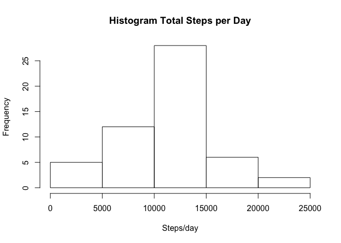
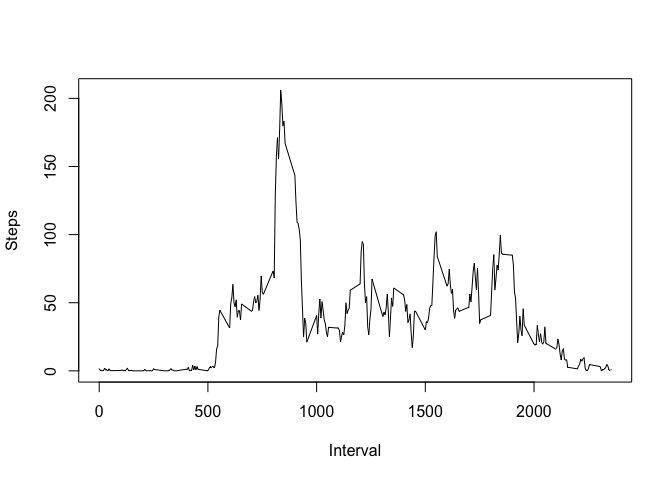
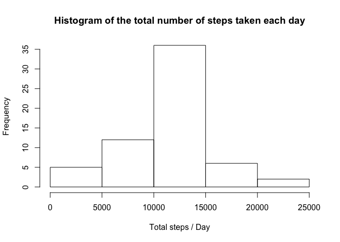
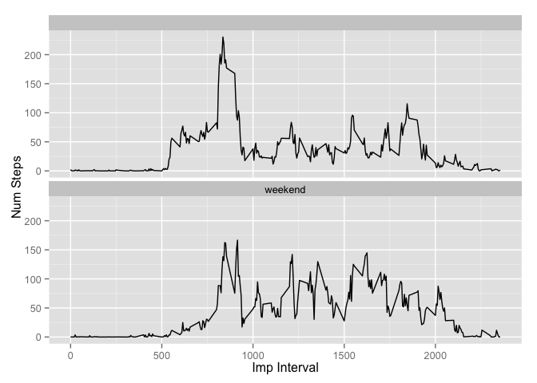

# Reproducible Research: Peer Assessment 1


## Loading and preprocessing the data


```r
library(ggplot2) # Import plot
data <- read.csv("activity.csv") # Load the data from the file.
originalData <- data
data <- data.frame(data)         # Create a data frame.
datafiltered <- na.omit(data)    # Filter out rows with NA values
```
## What is mean total number of steps taken per day?

```r
# Calc the total number of steps per day using the sum function.
tSteps <- aggregate(steps ~ date, data = datafiltered, sum)  
# Make a histogram of the total number of steps per day
hist(tSteps$steps, main="Histogram Total Steps per Day", xlab="Steps/day") 
```

 

```r
# Calculate the mean of total number of steps per day
meanSteps <- mean(tSteps$steps)
# Report the mean of total number of steps per day
meanSteps
```

```
## [1] 10766.19
```

```r
# Calculate the median of total number of steps per day
medianSteps <- median(tSteps$steps)
# Report the median of total number of steps per day
medianSteps
```

```
## [1] 10765
```

## What is the average daily activity pattern?

```r
intervalSteps <- aggregate(steps ~ interval, data = datafiltered, mean)
plot(steps ~ interval, data = intervalSteps, type = "l",xlab="Interval",ylab = "Steps")
```

 

```r
maximumStepsInterval <- intervalSteps[which.max(intervalSteps$steps), ]
# Print maximumStepsInterval
maximumStepsInterval
```

```
##     interval    steps
## 104      835 206.1698
```

## Imputing missing values

```r
numMissingValues <- sum(is.na(data)) # Use the original (unfiltered) data set and count NA's
# Print result
numMissingValues
```

```
## [1] 2304
```

```r
# Calculate imputed data set
for (i in 1:nrow(data)){
  if (is.na(data$steps[i])){
    value <- data$interval[i]
    numRow <- which(intervalSteps$interval == value)
    steps <- intervalSteps$steps[numRow]
    data$steps[i] <- steps
  }
}


imputed <- aggregate(steps ~ date, data, sum)

# Create histogram 
hist(imputed$steps, main="Histogram of the total number of steps taken each day", xlab="Total steps / Day")
```

 

```r
# Calculate the mean of total number of steps per day with imputed data set
meanStepsImp <- mean(imputed$steps)
# Report the mean 
meanStepsImp
```

```
## [1] 10766.19
```

```r
# Calculate the median of total number of steps per day
medianStepsImp <- median(imputed$steps)
# Report the median 
medianStepsImp
```

```
## [1] 10766.19
```

The mean and median stays app. the same.


## Are there differences in activity patterns between weekdays and weekends?

```r
# Convert date from string
data$date <- as.Date(data$date, "%Y-%m-%d")

# Using function weekdays to convert to weekday strings
data$day <- weekdays(data$date)

# New day type column 
data$dayType <- c(" ")

# Convert to weekend if day = Saturday or Sunday
for (i in 1:nrow(data)){
  if (data$day[i] == "Saturday" ){
    data$dayType[i] <- "weekend"
  }
  else if (data$day[i] == "Sunday"){
    data$dayType[i] <- "weekend"
  }
}


data$dayType <- as.factor(data$dayType)

# Calc mean for day type
newDataSet <- aggregate(steps ~ interval+dayType, data, mean)


# make plot for weekdays and weekends
qplot(interval, steps, data=newDataSet, geom=c("line"), xlab="Imp Interval", ylab="Num Steps") + facet_wrap(~ dayType, ncol=1)
```

 
